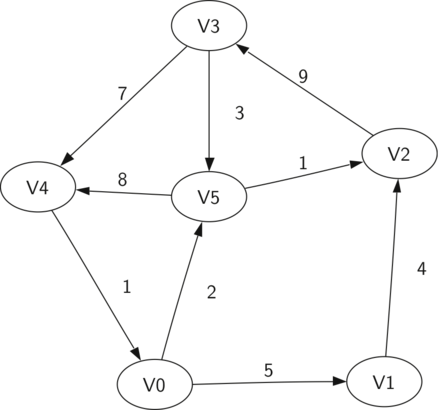

Graph
======
图，是由顶点集合以及顶点间的关系集合组成的一种数据结构。其拥有以下组件：顶点和边是图的基本部分，边连接两个顶点，以表明它们之间存在关系。边可以被加权重以示出从一个顶点到另一个顶点的成本。路径是由边连接的顶点序列。有向图中的循环是在同一顶点开始和结束的路径。

示意图
------


Graph操作
------
* add_vertex(key) 向图中添加一个顶点实例。
* add_edge(from_key, to_key) 向连接两个顶点的图添加一个新的有向边。
* add_edge(from_key, to_key, weight) 向连接两个顶点的图添加一个新的加权重的有向边。
* get_vertex(key)  在图中找到名为 key 的顶点。
* get_vertices() 返回图中所有顶点的列表。
* in 返回 True 如果给定的顶点在图中。

Graph实现
------
* [Graph](Graph.py)

实际应用
------
* [构建字梯图](#构建字梯图)
* [广度优先搜索](#广度优先搜索)
* [构建骑士游历图](#构建骑士游历图)
* [骑士游历](#骑士游历)
* [深度优先搜索](#深度优先搜索)
* [拓扑排序](#拓扑排序)
* [强连通分量](#强连通分量)

应用展示
------
#### [构建字梯图](WordLadderGraph.py)
```Python
# 构建字梯图
>>> from WordLadderGraph import word_ladder_graph
>>> words = ['21', '211', '271', '711']
>>> graph = word_ladder_graph(words)
>>> for from_vertex in graph:
...     print(from_vertex)
...
211 connected to: ['711', '271']
711 connected to: ['211']
271 connected to: ['211']
```

#### [广度优先搜索](BFS.py)
```Python
# 广度优先搜索
>>> from WordLadderGraph import word_ladder_graph
>>> from BFS import bfs, traverse
>>> words = ['21', '211', '271', '711']
>>> graph = word_ladder_graph(words)
>>> end_vertex = bfs(graph, '271', '711')
>>> traverse(end_vertex)
711
211
271
```

#### [构建骑士游历图](KnightGraph.py)
```Python
# 构建骑士游历图
>>> from KnightGraph import knight_graph
>>> graph = knight_graph(3)
>>> for from_vertex in graph:
...     print(from_vertex)
...
0 connected to: [5, 7]
5 connected to: [0, 6]
7 connected to: [0, 2]
1 connected to: [6, 8]
6 connected to: [5, 1]
8 connected to: [3, 1]
2 connected to: [3, 7]
3 connected to: [2, 8]
```

#### [骑士游历](KnightTour.py)
```Python
# 骑士游历
>>> from KnightGraph import knight_graph
>>> from KnightTour import knight_tour, show_move_board
>>> # 构建骑士游历图
>>> board_size, start_key = 6, 6
>>> graph = knight_graph(board_size)
>>> # 设置骑士游历参数值
>>> depth = 1
>>> path = []
>>> start_vertex = graph.get_vertex(start_key)
>>> limit = board_size ** 2
>>> # 获取骑士游历结果
>>> print(knight_tour(depth, path, start_vertex, limit))
True
>>> # 展示骑士游历移动棋盘
>>> show_move_board(path)
11 24  1 16 13 32
 0 17 12 31  2 15
25 10 23 14 33 28
18  7 30 27 22  3
 9 26  5 20 29 34
 6 19  8 35  4 21
```

#### [深度优先搜索](DFS.py)
```Python
# 深度优先搜索
>>> from DFS import knight_dfs_graph, show_discovery_finish_time
>>> # 构建骑士游历图
>>> board_size = 6
>>> graph = knight_dfs_graph(board_size)
>>> # 深度优先搜索设置骑士游历棋盘各点发现时间和完成时间
>>> graph.dfs()
>>> # 展示骑士游历棋盘各点发现时间和完成时间
>>> show_discovery_finish_time(graph)
 1/72 16/57 11/62  6/67  3/70 20/21
10/63  5/68  2/71 15/58 12/61  7/66
17/56 14/59  9/64  4/69 19/54 40/41
26/29 23/44 18/55 13/60  8/65 31/32
37/38 50/51 25/34 22/47 39/42 48/53
24/35 27/28 36/43 49/52 30/33 45/46
```

#### [拓扑排序](DFS.py)
```Python
# 拓扑排序
>>> from DFS import DFSGraph
>>> from TopologicalSorting import topological_sorting
>>> graph = DFSGraph()
>>> graph.add_edge(21, 211)
>>> graph.add_edge(211, 711)
>>> graph.add_edge(11, 21)
>>> graph.add_edge(71, 211)
>>> graph.add_edge(21, 271)
>>> graph.add_edge(271, 711)
>>> path = topological_sorting(graph)
>>> for vertex in path:
...     print(vertex)
...
71 connected to: [211]
11 connected to: [21]
21 connected to: [211, 271]
271 connected to: [711]
211 connected to: [711]
711 connected to: []
```

#### [强连通分量](SCC.py)
```Python
# 强连通分量
>>> from DFS import DFSGraph
>>> from SCC import scc
>>> graph = DFSGraph()
>>> graph.add_edge('A', 'B')
>>> graph.add_edge('B', 'C')
>>> graph.add_edge('C', 'F')
>>> graph.add_edge('F', 'H')
>>> graph.add_edge('H', 'I')
>>> graph.add_edge('I', 'F')
>>> graph.add_edge('C', 'C')
>>> graph.add_edge('B', 'E')
>>> graph.add_edge('E', 'D')
>>> graph.add_edge('D', 'G')
>>> graph.add_edge('G', 'E')
>>> graph.add_edge('D', 'B')
>>> graph.add_edge('E', 'A')
>>> scc(graph)
[['A', 'E', 'G', 'B', 'D'], ['C'], ['F', 'I', 'H']]
```