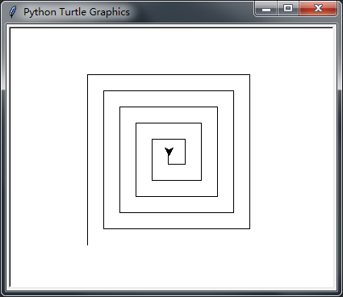
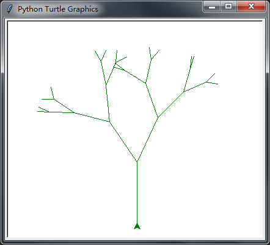
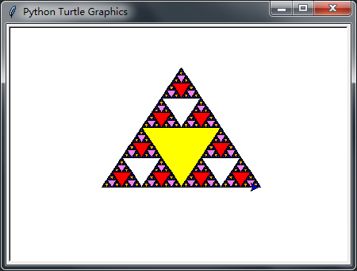

Recursion
======
递归是一种解决问题的方法，将问题分解为更小的子问题，直到得到一个足够小的问题可以被很简单的解决。通常递归涉及函数调用自身。递归允许我们编写优雅的解决方案，解决可能很难编程的问题。

递归的三定律
------
1. 递归算法必须具有基本情况。
2. 递归算法必须改变其状态并向基本情况靠近。
3. 递归算法必须以递归方式调用自身。

实际应用
------
* [计算整数列表和](#计算整数列表和)
* [十进制转换任意进制字符串](#十进制转换任意进制字符串)
* 可视化递归
   * [螺旋](#螺旋)
   * [分形树](#分形树)
   * [谢尔宾斯基三角形](#谢尔宾斯基三角形)
* [汉诺塔](#汉诺塔)
* [找零](#找零)

应用展示
------
#### [计算整数列表和](listSum.py)
```Python
# 计算整数列表和
>>> from listSum import list_sum
>>> list_sum([1])
1
>>> list_sum([1, 3, 5, 7, 9, 11])
36
>>> list_sum([1, 7, 11, 21, 211])
251
```

#### [十进制转换任意进制字符串](toStr.py)
```Python
# 十进制转换任意进制字符串
>>> from toStr import to_str
>>> to_str(211, 2)
'11010011'
>>> to_str(211, 8)
'323'
>>> to_str(211, 16)
'D3'
```

#### [螺旋](spiral.py)


#### [分形树](fractalTree.py)


#### [谢尔宾斯基三角形](SierpinskiTriangle.py)


#### [汉诺塔](HanoiTower.py)
```Python
# 汉诺塔
>>> from HanoiTower import hanoi_tower
>>> hanoi_tower(3)
'moving "1" from FromPole to ToPole'
'moving "2" from FromPole to WithPole'
'moving "1" from ToPole to WithPole'
'moving "3" from FromPole to ToPole'
'moving "1" from WithPole to FromPole'
'moving "2" from WithPole to ToPole'
'moving "1" from FromPole to ToPole'
```

#### [找零](makeChange.py)
```Python
# 找零
>>> from makeChange import make_change, get_changes
>>> coins = [1, 5, 10, 20]
>>> change = 27
>>> know_change_num = [0] * 28
>>> min_coins_list = [0] * 28
>>> make_change(coins, change, know_change_num, min_coins_list)
4
>>> get_changes(change, min_coins_list)
[1, 1, 5, 20]
>>> know_change_num
[0, 1, 2, 3, 4, 1, 2, 3, 4, 5, 1, 2, 3, 4, 5, 2, 3, 4, 5, 6, 1, 2, 3, 4, 5, 2, 3, 4]
>>> min_coins_list
[0, 1, 1, 1, 1, 5, 1, 1, 1, 1, 10, 1, 1, 1, 1, 5, 1, 1, 1, 1, 20, 1, 1, 1, 1, 5, 1, 1]
```