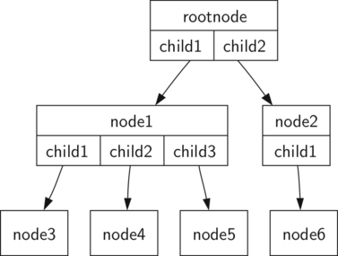

Tree
======
树，由一组节点和一组连接节点的边组成。其的一个节点被指定为根节点。除了根节点之外，每个节点 n 通过一个其他节点 p 的边连接，其中 p 是 n 的父节点。从根路径遍历到每个节点路径唯一。如果树中的每个节点最多有两个子节点，我们说该树是一个二叉树。

树是空的，或者由一个根节点和零个或多个子树组成，每个子树也是一棵树。每个子树的根节点通过边连接到父树的根节点。

二叉堆，允许在 O(logn) 中排队和取出队列，有两个常见的变体：最小堆（其中最小的键总是在前面）和最大堆（其中最大的键值总是在前面）。

二叉查找树，从键映射到值的一种方法，左子树中的所有键小于根中的键。 右子树中的所有键都大于根。不平衡的二叉查找树在最坏情况下 put 方法的性能是 O(n)。

AVL 树，一种平衡二叉查找树，自动确保树始终保持平衡。put 的最坏情况性能是 O(logn)。

示意图
------



二叉树操作
------
* insert_left(new_node) 向树中添加一个左子树。
* insert_right(new_node) 向树中添加一个右子树。
* get_left_child() 获取左孩子。
* get_right_child() 获取右孩子。
* set_root_value(new_value) 设置根节点的值。
* get_root_value() 获取根节点的值。

二叉堆操作
------
* 最小堆
   * insert(value) 向堆中添加一个新项。
   * find_min() 返回具有最小键值的项，并将项留在堆中。
   * del_min() 返回具有最小键值的项，从堆中删除该项。
   * is_empty() 如果堆是空的，返回 true，否则返回 false。
   * size() 返回堆中的项数。
   * build_heap(list) 从 list 构建一个新的堆。
* 最大堆
   * insert(value) 向堆中添加一个新项。
   * find_max() 返回具有最大键值的项，并将项留在堆中。
   * del_max() 返回具有最大键值的项，从堆中删除该项。
   * is_empty() 如果堆是空的，返回 true，否则返回 false。
   * size() 返回堆中的项数。
   * build_heap(list) 从 list 构建一个新的堆。

二叉查找树操作
------
* put(key, value) 向树中添加一个新的键值对。如果键已经在树中，那么用新值替换旧值。
* get(key) 给定一个键，返回存储在 tree 中的值，否则为 None。
* del 使用 del tree[key] 形式的语句从 tree 中删除键值对。
* len() 返回存储在映射中的键值对的数量。
* in 返回 True 如果给定的键在 tree 中。

树实现
------
* 二叉树
   * [BinaryTreeBasedOnList：列表表示](BinaryTreeBasedOnList.py)
   * [BinaryTree：节点表示](BinaryTree.py)
* 二叉堆
   * [MinHeap：最小堆](MinHeap.py)
   * [MaxHeap：最大堆](MaxHeap.py)
* [BinarySearchTree：二叉查找树](BinarySearchTree.py)
* [AVLTree：AVL平衡二叉查找树](AVLTree.py)

实际应用
------
* [ParseTree：分析树](#分析树)
* [TreeTraversals：树的遍历](#树的遍历)
* [BinaryHeapsSort：二叉堆排序](#二叉堆排序)

应用展示
------
#### [分析树](buildParseTree.py)
```Python
# 分析树
>>> from buildParseTree import build_parse_tree
>>> tree = build_parse_tree('( ( 11 + 6 ) * 2 )')
>>> evaluate(tree)
34
```

#### [树的遍历](threePatternsTraversals.py)
```Python
# 树的遍历
>>> from buildParseTree import build_parse_tree
>>> from threePatternsTraversals import pre_order, post_order, in_order, print_expressions
>>> tree = build_parse_tree('( ( 11 + 6 ) * 2 )')
>>> pre_order(tree)
*
+
11
6
2
>>> post_order(tree)
11
6
+
2
*
>>> in_order(tree)
11
+
6
*
2
>>> print_expressions(tree)
(((11)+(6))*(2))
```

#### [二叉堆排序](BinaryHeapSort.py)
```Python
# 二叉堆排序
>>> from BinaryHeapSort import min_heap_sort, max_heap_sort
>>> test_list = [211, 21, 71, 711, 11]
>>> min_heap_sort(test_list)
>>> test_list
[11, 21, 71, 211, 711]
>>> test_list = [211, 21, 71, 711, 11]
>>> max_heap_sort(test_list)
>>> test_list
[711, 211, 71, 21, 11]
```